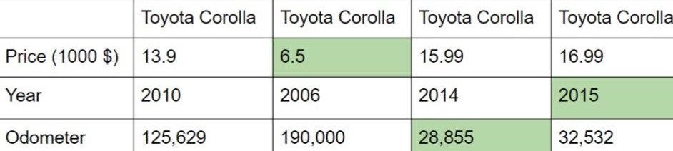
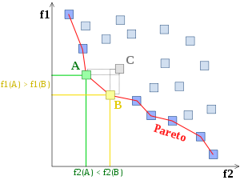

# Capstone project: Multi-Objective Optimization Problem on the example of buying a car.

### Project outline:

- Problem statement and assumptions
- Web scraping 
- Data cleaning and preprocessing
- Modelling
- Results visualization

In my Capstone Progect at General Assembly I used Evolutionary Genetic Algorithm (NSGA-II) to solve multiobjective problem.

### Problem statement:
Smeone is planning to buy a car. Assumption: buyer usually know which car make he or she wants. this assumption was made because most of car makes have its own rate of price decrease (I found it out after scraping data for different car makes). For my analysis I picked most popular car in Australia - Toyota Corolla. The most important features are price, age and odometer (our objectives). 

To understand the problem let's have a look at those four as an example:

It is unclear which one is the best deal. Because a buyer wants the cheapest car with the least odometer and the newest one at the same time. This simple problem is the example multi-objective optimization problem and finding non-dominated solutions.
https://en.wikipedia.org/wiki/Multi-objective_optimization

For this particular case it is required to minimize all the objectives (price, age and odometer). So Pareto-frontier will look like this (in 2D case):

### Web Scraping:

I collected data for my project by scraping it from web-site www.carsales.com.au. Somehow they didn't block me. Final acquired dataset (before cleaning) was around 4000 cars. I used urllib, requests and Beautiful Soup libraries.

### Data cleaning and preprocessing

Original data set was really messy mainly because all the car make features were placed under one tag:
 
![] (./pics/pastedImage0.png)

Final data set used for analysis is saved as "corolla.csv"

### Modelling

Optimization of three objective will result in building surface of non-dominated solutions. 
https://en.wikipedia.org/wiki/Pareto_efficiency

For building Pareto surface I used NSGA-II(non-dominated sorting genetic algorithm). Genetic algorithm mimics evolution process. Solutions are sorted on a base of their fitness score. At each step genetic algorithm simulates the survival generation of the fittest among individuals over consecutive generation for solving a multiobjective problem. Each individual represents a point in a search space and a possible solution. The survived individuals in the population are then made to go through a process of evolution.

Epsiolon parameter sets resolution of solutions found. 
For epsilon = 1e-9 (for all three dimentions), there are 133 non-dominated solutions (out of original 3397):

![] (./pics/3d1e-9.png)

Futher customization allows reducing number of solutions:

--epsilons 1 1000 100
![] (./pics/figure_1-15.png)

--epsilons 2 5000 500
![] (./pics/figure_1-14.png)

--epsilons 5 10000 1000
![] (./pics/figure_1-13.png)

--epsilons 7 15000 3000
![] (./pics/figure_1-12.png)

--epsilons 10 20000 5000
![] (./pics/figure_1-11.png)

### References
1. Kalyanmoy Deb (23 March 2009). Multi-Objective Optimization Using Evolutionary Algorithms. John Wiley & Sons. ISBN 978-0-470-74361-4. Retrieved 1 November 2012.
 
2. Nondominated sorting for multi-objective problems by matthewjwoodruff and jdherman

3. https://en.wikipedia.org/wiki/Pareto_efficiency

4. https://en.wikipedia.org/wiki/Multi-objective_optimization

5. http://www.iitk.ac.in/kangal/index.shtml: Kanpur Genetic Algorithms Laboratory Homepage

5. http://waterprogramming.wordpress.com: Waterprogramming Research Blog

6. Deb, K., M. Mohan, and S. Mishra. 2005 "Evaluating the epsilon-domination based multiobjective evolutionary algorithm for a quick computation of Pareto-optimal solutions" Evolutionary Computation Journal 13 (4): 501-525.

7. Deb, K., A. Pratap, S. Agarwal, and T. Meyarivan. 2002. "A fast and elitist multiobjective genetic algorithm: NSGA-II." 

8. IEEE Transactions on Evolutionary Computation 6 (2): 182-197.

9. Srinivas, N., and K. Deb. 1994. "Multiobjective optimization using nondominated sorting in genetic algorithms." Evolutionary Computation 2 (2): 221-248.

